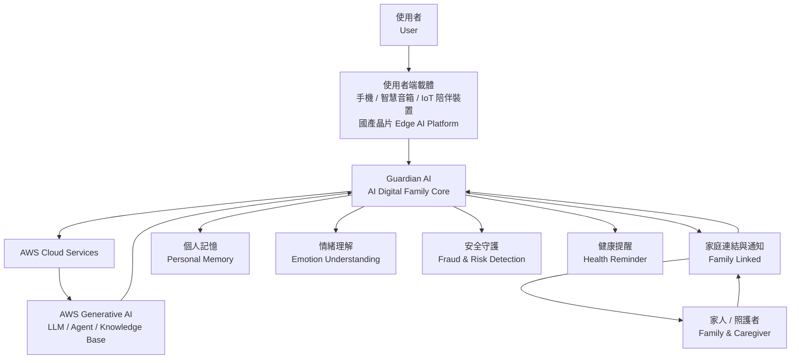

# 2026AIWave: Taiwan Generative AI Application Hackathon

The 3rd **AI Wave: Taiwan Generative AI Application Hackathon** brings together government, academia, and industry to tackle Taiwan's most pressing social challenges through Generative AI. This year's themes focus on real-world impact, including aging society, inclusive technology, smart healthcare, financial security, talent development, and resilient communities.

---

# Human First | Guardian AI

  
**AI Digital Family for Aging Society**

Guardian AI is a human-centered AI companion platform designed for Taiwan's rapidly aging society. Rather than building another AI assistant, Guardian AI acts as a trusted **AI Digital Family** that provides long-term companionship, safety, and family connection for senior citizens.

Our vision is simple:

> **AI should not replace people. It should help people stay connected.**

---

## Why Guardian AI?

Taiwan officially became a **super-aged society** in 2025. As the population continues to age, many seniors face challenges including:

- ❤️ Loneliness and emotional isolation
- 🩺 Physical and mental health management
- 🛡️ Fraud and scam prevention
- 📱 Digital divide
- 👨‍👩‍👧 Reduced family interaction

Existing technologies solve individual problems, but few provide continuous companionship with a human-centered design.

Guardian AI bridges this gap.

---

## Guardian AI System Architecture

---

## Core Features

- ❤️ Emotional companionship with Generative AI
- 🩺 Health reminders and daily wellness support
- 🛡️ Scam detection and safety protection
- 👨‍👩‍👧 Family connection and emergency notifications
- 🧠 Personalized long-term memory
- 🎙️ Natural voice interaction

---

## Platform Architecture

Guardian AI is designed as a cross-platform AI companion ecosystem.

Supported platforms include:

- 📱 Mobile Application
- 🔊 Smart Speaker
- 🤖 AI Companion Robot (IoT)
- ⚙️ Edge AI devices powered by domestic semiconductor platforms

Inspired by smartphone-powered companion robot concepts, Guardian AI can evolve from a mobile application into an affordable AI companion device for everyday home use.

---

## Technology Stack

- AWS Generative AI Services
- AWS Cloud Infrastructure
- Generative AI (LLM)
- IoT Companion Devices
- Edge AI Computing
- Voice Interaction
- Memory-based AI Agent

---

## Vision

Guardian AI is more than an application.

It is a future AI companion ecosystem that combines cloud AI, edge computing, IoT, and Taiwan's semiconductor innovation to create inclusive technology for an aging society.

> **Technology should become companionship, not distance.**
